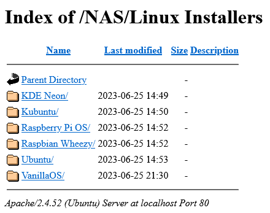
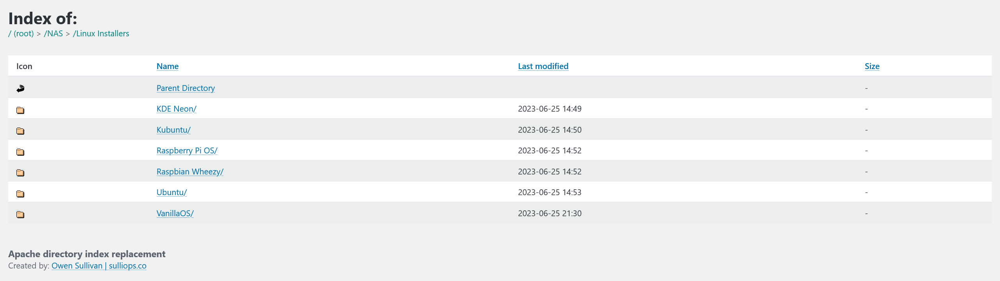

# apache-directory-index-replacement
Custom front end modifications for directory index pages generated by Apache mod_autoindex.

This project's intended use is for WebDAV servers that *don't* use Apache's `Alias` directive to direct visitors to the WebDAV share.

## Introduction
Apache's default directory index pages, which are generated by [mod_autoindex](https://httpd.apache.org/docs/2.4/mod/mod_autoindex.html), are boring and outdated. This is for good reason — no reliance on third-party libraries means fewer dependencies to keep track of — but there's something to be said about a responsive design for frequently-used pages in the modern era.



After applying a few configuration options (i.e., `IndexOptions`, `HeaderName`, `ReadmeName`, etc.) in the Apache virtual host configuration responsible for a WebDAV share and pasting the custom theme files into the root of the share, the directory listings look something like this:



The resulting HTML page is pretty, fully responsive, and mobile-ready, and it includes (mostly) functional breadcrumb navigation powered by [Pico CSS](https://github.com/picocss/pico).

Some of the file/directory details that are normally provided by mod_autoindex are disabled in the configuration for the sake of simplicity, but the table (re-)building logic *should* be able to handle re-enabling the description row. Sorting functionality via queries is still supported.

## Configuration
To use the custom theme, a few changes must be made to an existing Apache virtual host configuration. A [sample config file](webdav-sample.conf) is provided in this repository, and it can be used as a replacement config file after following [DigitalOcean's Apache WebDAV tutorial](https://www.digitalocean.com/community/tutorials/how-to-configure-webdav-access-with-apache-on-ubuntu-18-04).

Assuming WebDAV is setup and enabled in an existing virtual host config, add the following within the `<Directory>` block that controls the WebDAV share:

```
# DIRECTORY CUSTOMIZATION
<IfModule mod_autoindex.c>

	# SET INDEX OPTIONS
	IndexOptions IgnoreCase FancyIndexing FoldersFirst NameWidth=* SuppressHTMLPreamble SuppressDescription HTMLTable

	# SET DISPLAY ORDER
	IndexOrderDefault Ascending Name

	# IGNORE CUSTOM FILES
	IndexIgnore header.html footer.html favicon.ico .htaccess .ftpquota .DS_Store icons *.log *,v *,t .??* *~ *#

	# SPECIFY HEADER FILE
	HeaderName /.theme/header.html
	# SPECIFY FOOTER FILE
	ReadmeName /.theme/footer.html

</IfModule>
```

Then, simply copy the [.theme](.theme/) directory into the root of your WebDAV share and restart apache2. The various configuration options can be changed as required and reloaded by restarting apache2.

**Important note:** the breadcrumb navigation provided by the custom front end assumes a directory structure that begins at the root of your domain or hostname. For example: visiting `http://localhost/` places you in the root of your WebDAV share, as opposed to `http://localhost/webdav/` coupled with the Apache `Alias` directive as recommended by many tutorials. Breadcrumb navigation may not work as expected when configuration differs from the sample config.

## Credits
Thanks to a number of folks on StackOverflow for tidbits of information regarding mod_autoindex behavior, but most importantly to [Jeff Star](https://perishablepress.com/author/perish/) for his incredible [write-up on directory listing customizations](https://perishablepress.com/better-default-directory-views-with-htaccess/).

Additionally, becoming familiar with the [mod_autoindex configuration options](https://httpd.apache.org/docs/2.4/mod/mod_autoindex.html) is a must for modifying this project.

Finally, thanks to [Pico CSS](https://picocss.com/) for a minimal, easy-to-use front end framework. I would have abandoned this idea if I had to use Bootstrap.